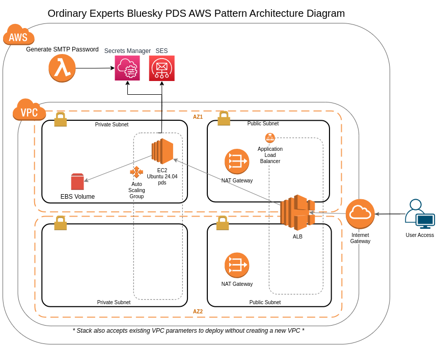

# Bluesky PDS on AWS

## Overview

The Ordinary Experts Bluesky PDS AWS Marketplace product is a CloudFormation template with a custom AMI which provisions a production-ready [Bluesky PDS](https://github.com/bluesky-social/pds) system. It uses the following AWS services:

* VPC (operator can pass in VPC info or product can create a VPC)
* EC2 - it provisions an Auto Scaling Group for the web application tier
* ALB - load balancer for EC2 instance
* SES - for sending email
* Route53 - for setting up friendly domain names
* ACM - for SSL
* and others...(IAM, Secrets Manager, SSM)

## Architecture Diagram

## How to deploy

### Pre-work

Before deploying the pattern, you will need the following provisioned in the AWS account you are going to use:

* A hosted zone set up in Route53
* A SSL certificate set up in Amazon Certificate Manager

Also, this pattern optionally sets up a SES Domain Identity with EasyDKIM support based on the DNS Hosted Zone that is provided. If this SES Domain Identity already exists, you can set the `SesCreateDomainIdentity` parameter to `false`.

If you are just starting using SES with this product, then be aware your account will start in "sandbox" mode, and will only send emails to verified email identities. You will need to move to SES "production" mode before having general users in your site.

See [this AWS information about the SES sandbox](https://docs.aws.amazon.com/ses/latest/dg/request-production-access.html) for more info.

### Deploying

To deploy, subscribe to the product and then launch the provided CloudFormation template.

### Post-deploy setup

After an initial deployment, you can create an initial user by connecting to the instance via the SSM Sessions Manager, then using `pdsadmin`.

See more info here:

https://github.com/bluesky-social/pds/tree/main?tab=readme-ov-file#creating-an-account-using-pdsadmin

Here is an example, starting from when SSM Sessions Manager connects to the instance:

    $ sudo su -
    root@ip-10-0-1-246:~# pdsadmin account create
    Enter an email address (e.g. alice@blueskypds-dylan.dev.patterns.ordinaryexperts.com): myemail@mydomain.com
    Enter a handle (e.g. alice.blueskypds-dylan.dev.patterns.ordinaryexperts.com): myhandle.blueskypds-dylan.dev.patterns.ordinaryexperts.com

    Account created successfully!
    -----------------------------
    Handle   : myhandle.blueskypds-dylan.dev.patterns.ordinaryexperts.com
    DID      : did:plc:wbhuylqx5of2rnqn4o5pfncj
    Password : p0HeBeIctF0p53KBkxBb608V
    -----------------------------
    Save this password, it will not be displayed again.

    root@ip-10-0-1-246:~#
